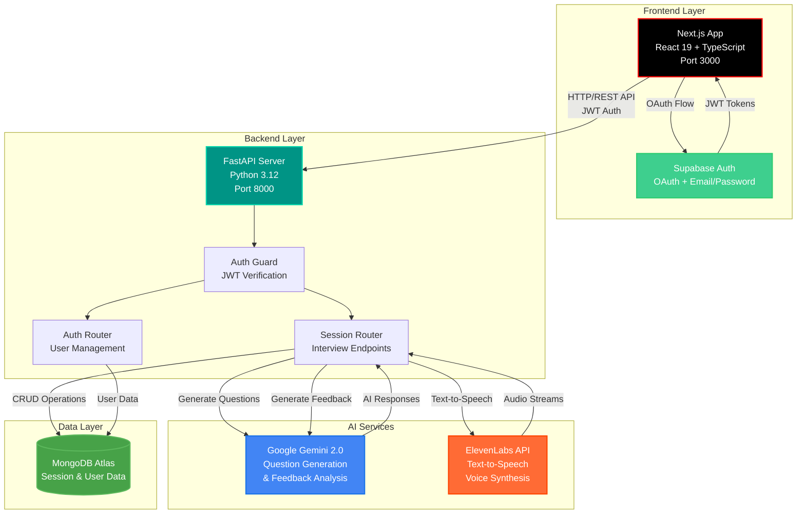
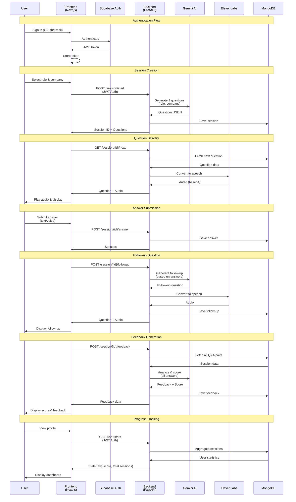

# 🎯 JobJitsu - AI-Powered Interview Practice Platform

<div align="center">

**Transform your interview preparation with AI-driven practice sessions that feel like the real thing.**

[](https://jobjitsu.tech)
[](https://github.com)

[](https://nextjs.org/)
[](https://react.dev/)
[](https://fastapi.tiangolo.com/)
[](https://www.typescriptlang.org/)
[](https://www.mongodb.com/)

*Built for HackRU Fall 2025 • [Demo available at JobJitsu.tech](https://jobjitsu.tech) (Some features may be in development)*

</div>

---

## 📋 Table of Contents

- [Overview](#-overview)
- [Problem Statement](#-problem-statement)
- [Solution](#-solution)
- [Key Features](#-key-features)
- [Tech Stack](#-tech-stack)
- [Architecture](#-architecture)
- [Project Structure](#-project-structure)
- [Getting Started](#-getting-started)
- [API Documentation](#-api-documentation)
- [Technical Highlights](#-technical-highlights)
- [Future Enhancements](#-future-enhancements)
- [Contributing](#-contributing)

---

## 🎯 Overview

**JobJitsu** is a full-stack AI-powered interview practice platform designed to help students and job seekers prepare for real-world interviews, particularly career fair conversations with recruiters. The platform leverages cutting-edge AI (Google Gemini) to generate contextual interview questions, ElevenLabs for realistic text-to-speech, and provides comprehensive feedback to help users improve their interview skills.

> 🌐 **Demo Application**: A working demo is available at [**JobJitsu.tech**](https://jobjitsu.tech). This is a hackathon project demonstrating the core concept and technical implementation. Some features may have limitations or be under active development. For the full experience, consider running the application locally using the setup instructions below.

### Why JobJitsu?

- **Realistic Practice**: Simulate actual recruiter conversations with AI-generated questions tailored to specific roles and companies
- **Instant Feedback**: Receive detailed, actionable feedback with numerical scores (1-10) and improvement suggestions
- **Voice Integration**: Practice with realistic recruiter voices powered by ElevenLabs TTS
- **Progress Tracking**: Monitor your improvement over time with detailed analytics and session history
- **Modern UX**: Beautiful, responsive interface built with modern web technologies

---

## 🎯 Problem Statement

Students often struggle with:
- **Nervousness** when talking to recruiters at career fairs
- **Lack of practice** opportunities before real interviews
- **Unclear feedback** on their interview performance
- **Generic preparation** that doesn't match specific company/role requirements

JobJitsu addresses these challenges by providing a safe, accessible platform for realistic interview practice with AI-powered feedback.

---

## ✨ Solution

JobJitsu combines:
- **AI Question Generation**: Context-aware questions generated by Google Gemini based on role and company
- **Realistic Voice Simulation**: ElevenLabs TTS creates natural-sounding recruiter voices
- **Intelligent Feedback**: AI analyzes answers and provides structured feedback with scores
- **Follow-up Questions**: Dynamic follow-up questions based on user responses
- **Progress Analytics**: Track performance metrics over time

---

## 🚀 Key Features

### 🎤 **AI-Powered Interview Sessions**
- Start practice sessions by selecting a target role and company
- Receive 3 contextual questions generated by Google Gemini
- Answer questions via text input or voice recognition
- Get dynamic follow-up questions based on your responses

### 🎙️ **Realistic Voice Experience**
- ElevenLabs text-to-speech integration for natural recruiter voices
- Audio playback for all interview questions
- Browser-based speech recognition for voice input

### 📊 **Comprehensive Feedback System**
- Numerical scoring (1-10 scale) for each session
- Detailed feedback breakdown by question
- Overall performance analysis with strengths and areas for improvement
- Structured feedback format for easy comprehension

### 📈 **Progress Tracking**
- User profile dashboard with session statistics
- Average score calculation across all sessions
- Best score tracking
- Recent session history with detailed feedback
- Visual progress indicators

### 🔐 **Secure Authentication**
- OAuth integration (Google, GitHub)
- Email/password authentication via Supabase
- JWT-based session management
- Protected API routes with authentication guards

### 🎨 **Modern User Interface**
- Responsive design optimized for all devices
- Dark theme with custom red/black color scheme
- Smooth animations and transitions
- Intuitive chat-like interview interface
- Real-time typing indicators and loading states

---

## 🛠️ Tech Stack

### **Frontend**
- **Framework**: Next.js 15.5 (App Router)
- **Language**: TypeScript 5.0
- **UI Library**: React 19.1
- **Styling**: Tailwind CSS 4.0
- **Components**: shadcn/ui (Radix UI primitives)
- **State Management**: Zustand, React Query (TanStack Query)
- **Authentication**: Supabase Auth Helpers
- **Animations**: Framer Motion
- **Charts**: Recharts

### **Backend**
- **Framework**: FastAPI 0.104
- **Language**: Python 3.12
- **Database**: MongoDB Atlas (NoSQL)
- **AI Services**:
  - Google Gemini 2.0 Flash (question generation, feedback)
  - ElevenLabs API (text-to-speech)
- **Authentication**: Supabase (JWT tokens)
- **API Documentation**: FastAPI auto-generated docs

### **Infrastructure**
- **Database**: MongoDB Atlas (cloud-hosted)
- **Authentication Service**: Supabase
- **Deployment**: Vercel (frontend), Railway/Render (backend)
- **Environment Management**: dotenv

---

## 🏗️ Architecture

### **System Architecture**



### **Data Flow**



### **Key Design Decisions**

- **Separation of Concerns**: Clear frontend/backend separation for scalability
- **RESTful API Design**: Standard HTTP methods and status codes
- **JWT Authentication**: Stateless authentication for scalability
- **NoSQL Database**: MongoDB chosen for flexible session data structure
- **AI Service Integration**: Modular design allows easy swapping of AI providers
- **Real-time Updates**: React Query for efficient data fetching and caching

---

## 📁 Project Structure

```
HACKRU_FALL25_JobJitsu/
├── jobjitsu/                    # Frontend (Next.js)
│   ├── src/
│   │   ├── app/                # Next.js App Router pages
│   │   │   ├── page.tsx        # Landing page
│   │   │   ├── practice/       # Practice session setup
│   │   │   ├── interview/      # Interview session UI
│   │   │   ├── profile/        # User profile & stats
│   │   │   └── auth/           # Authentication pages
│   │   ├── components/         # React components
│   │   │   ├── ui/             # shadcn/ui components
│   │   │   ├── ChatBubble.tsx  # Interview message UI
│   │   │   ├── ScoreCard.tsx   # Feedback display
│   │   │   └── Navbar.tsx      # Navigation
│   │   ├── hooks/              # Custom React hooks
│   │   │   └── useSpeechRecognition.ts
│   │   ├── services/           # API service layer
│   │   │   └── api.ts          # Backend API client
│   │   └── lib/                # Utilities
│   │       ├── supabase.ts     # Supabase client
│   │       └── utils.ts        # Helper functions
│   ├── public/                 # Static assets
│   ├── package.json
│   └── tsconfig.json
│
├── jobjitsu_backend/           # Backend (FastAPI)
│   ├── main.py                 # FastAPI app entry point
│   ├── routers/
│   │   ├── auth.py             # Authentication endpoints
│   │   └── session.py          # Interview session endpoints
│   ├── services/
│   │   ├── gemini_service.py   # Google Gemini integration
│   │   ├── elevenlabs_service.py  # TTS integration
│   │   ├── auth_service.py     # Supabase auth logic
│   │   └── auth_guard.py       # JWT verification
│   ├── models/
│   │   ├── user.py             # User data models
│   │   └── session.py          # Session data models
│   └── requirements.txt
│
├── interviewHubDB/              # Database service layer
│   ├── db_service.py           # MongoDB operations
│   ├── example_usage.py
│   └── README.md
│
└── README.md                   # This file
```

---

## 🚀 Getting Started

> 💡 **Demo Available**: A demo version is hosted at [**JobJitsu.tech**](https://jobjitsu.tech) for quick exploration. Note: Some features may have limitations. For the complete, fully-functional experience, we recommend running the application locally using the instructions below.

### **Prerequisites**

- Node.js 18+ and npm/yarn
- Python 3.12+
- MongoDB Atlas account (free tier)
- Supabase account (free tier)
- Google Gemini API key
- ElevenLabs API key (optional, for TTS)

### **Frontend Setup**

```bash
# Navigate to frontend directory
cd jobjitsu

# Install dependencies
npm install

# Set up environment variables
cp .env.example .env.local
# Add: NEXT_PUBLIC_BACKEND_URL=http://localhost:8000/api
# Add: NEXT_PUBLIC_SUPABASE_URL=your_supabase_url
# Add: NEXT_PUBLIC_SUPABASE_ANON_KEY=your_supabase_key

# Run development server
npm run dev
```

Frontend will be available at `http://localhost:3000`

### **Backend Setup**

```bash
# Navigate to backend directory
cd jobjitsu_backend

# Create virtual environment
python3 -m venv venv
source venv/bin/activate  # On Windows: venv\Scripts\activate

# Install dependencies
pip install -r requirements.txt

# Set up environment variables
cp .env.example .env
# Add:
# MONGO_URI=your_mongodb_connection_string
# DB_NAME=interviewhub
# SUPABASE_URL=your_supabase_url
# SUPABASE_SERVICE_KEY=your_service_key
# GEMINI_API_KEY=your_gemini_key
# ELEVENLABS_API_KEY=your_elevenlabs_key (optional)

# Run development server
python main.py
```

Backend API will be available at `http://localhost:8000`

### **Database Setup**

1. Create a MongoDB Atlas cluster (free tier)
2. Create database user and whitelist your IP
3. Copy connection string to `MONGO_URI` in backend `.env`
4. Database will be automatically created on first use

### **Supabase Setup**

1. Create a new Supabase project
2. Enable Google/GitHub OAuth providers in Authentication settings
3. Add redirect URLs: `http://localhost:3000/auth/callback`
4. Copy project URL and anon key to frontend `.env.local`
5. Copy service role key to backend `.env`

---

## 📚 API Documentation

### **Authentication Endpoints**

```
POST   /api/auth/signup          # Email/password signup
POST   /api/auth/login            # Email/password login
GET    /api/auth/verify          # Verify JWT token
POST   /api/auth/sync-user       # Sync OAuth user to MongoDB
GET    /api/user/stats           # Get user statistics
```

### **Session Endpoints**

```
POST   /api/session/start                    # Start new interview session
GET    /api/session/{id}/next               # Get next question
POST   /api/session/{id}/answer             # Submit answer
POST   /api/session/{id}/followup           # Get follow-up question
POST   /api/session/{id}/followup-answer    # Submit follow-up answer
POST   /api/session/{id}/feedback           # Get session feedback
```

### **Example Request**

```bash
# Start a session
curl -X POST "http://localhost:8000/api/session/start?role=Software%20Engineer&company=Google" \
  -H "Authorization: Bearer YOUR_JWT_TOKEN" \
  -H "Content-Type: application/json"
```

### **Interactive API Docs**

FastAPI automatically generates interactive API documentation:
- Swagger UI: `http://localhost:8000/docs`
- ReDoc: `http://localhost:8000/redoc`

---

## 💡 Technical Highlights

### **1. AI Integration Architecture**
- **Modular Design**: Separate service modules for Gemini and ElevenLabs
- **Error Handling**: Robust fallback mechanisms if AI services fail
- **Prompt Engineering**: Carefully crafted prompts for consistent, high-quality outputs
- **JSON Parsing**: Robust parsing with multiple fallback strategies for AI responses

### **2. Real-time User Experience**
- **React Query**: Efficient data fetching with caching and background updates
- **Optimistic Updates**: Immediate UI feedback before server confirmation
- **Loading States**: Comprehensive loading indicators throughout the app
- **Error Boundaries**: Graceful error handling with user-friendly messages

### **3. Authentication & Security**
- **JWT Tokens**: Stateless authentication for scalable architecture
- **Protected Routes**: Frontend and backend route protection
- **CORS Configuration**: Properly configured for production deployment
- **Environment Variables**: Secure secret management

### **4. Database Design**
- **Flexible Schema**: MongoDB allows dynamic question/answer structures
- **Session Tracking**: Complete interview session history
- **User Analytics**: Aggregated statistics for performance tracking
- **Efficient Queries**: Indexed queries for fast data retrieval

### **5. Voice Integration**
- **Browser Speech Recognition**: Native Web Speech API integration
- **Text-to-Speech**: ElevenLabs API for natural voice synthesis
- **Audio Playback**: Base64-encoded audio streaming
- **Fallback Handling**: Graceful degradation if TTS unavailable

### **6. Code Quality**
- **TypeScript**: Full type safety across frontend
- **Type Hints**: Python type hints for better code documentation
- **Error Logging**: Comprehensive logging for debugging
- **Code Organization**: Clear separation of concerns

---

## 🔮 Future Enhancements

### **Planned Features**
- [ ] **Multiple Interview Modes**
  - Behavioral interview practice
  - Technical coding challenges
  - System design interviews
  - Case study interviews

- [ ] **Advanced Analytics**
  - Performance trends over time
  - Comparison with peer performance
  - Detailed rubric breakdowns
  - Exportable reports

- [ ] **Enhanced AI Features**
  - Multiple recruiter personas (Big Tech, Startup, Consulting)
  - Bias mode toggle (inclusive vs. biased scenarios)
  - Industry-specific question banks
  - Personalized learning paths

- [ ] **Collaboration Features**
  - Peer review sessions
  - Mock interview scheduling
  - Interview preparation groups
  - Mentor matching

- [ ] **Mobile Application**
  - Native iOS/Android apps
  - Push notifications
  - Offline mode
  - Voice-only interviews

### **Technical Improvements**
- [ ] **Performance Optimization**
  - Redis caching for frequently accessed data
  - CDN for static assets
  - Database query optimization
  - Image optimization

- [ ] **Testing**
  - Unit tests for backend services
  - Integration tests for API endpoints
  - E2E tests for critical user flows
  - Performance testing

- [ ] **Monitoring & Analytics**
  - Application performance monitoring (APM)
  - Error tracking (Sentry)
  - User analytics (Mixpanel/Amplitude)
  - Log aggregation

---

## 🤝 Contributing

This project was built for HackRU Fall 2025. Contributions and feedback are welcome!

### **Development Workflow**

1. Fork the repository
2. Create a feature branch (`git checkout -b feature/amazing-feature`)
3. Commit your changes (`git commit -m 'Add amazing feature'`)
4. Push to the branch (`git push origin feature/amazing-feature`)
5. Open a Pull Request

### **Code Style**

- **Frontend**: ESLint + Prettier configuration
- **Backend**: Follow PEP 8 Python style guide
- **TypeScript**: Strict mode enabled
- **Commits**: Use conventional commit messages

---

## 📄 License

This project is open source and available under the [MIT License](LICENSE).

---

## 👥 Team

Built with ❤️ by the JobJitsu team for HackRU Fall 2025.

---

## 🙏 Acknowledgments

- **Google Gemini** for powerful AI question generation
- **ElevenLabs** for realistic text-to-speech
- **Supabase** for authentication infrastructure
- **MongoDB Atlas** for database hosting
- **Next.js & FastAPI** communities for excellent documentation

---

## 📞 Contact & Links

- **🌐 Demo Application**: [**JobJitsu.tech**](https://jobjitsu.tech) - Explore the demo (some features may be limited)
- **Backend API Docs**: `http://localhost:8000/docs` (when running locally)
- **Issues**: [GitHub Issues](https://github.com/yourusername/jobjitsu/issues)

> ⚠️ **Note**: The hosted demo at JobJitsu.tech is a proof-of-concept demonstration. Some features may not be fully functional or may have errors. For the best experience and to see all features working correctly, please run the application locally following the setup instructions above.

---

<div align="center">

**Made with ❤️ for job seekers everywhere**

*Transform your interview preparation. Land your dream job.*

</div>

